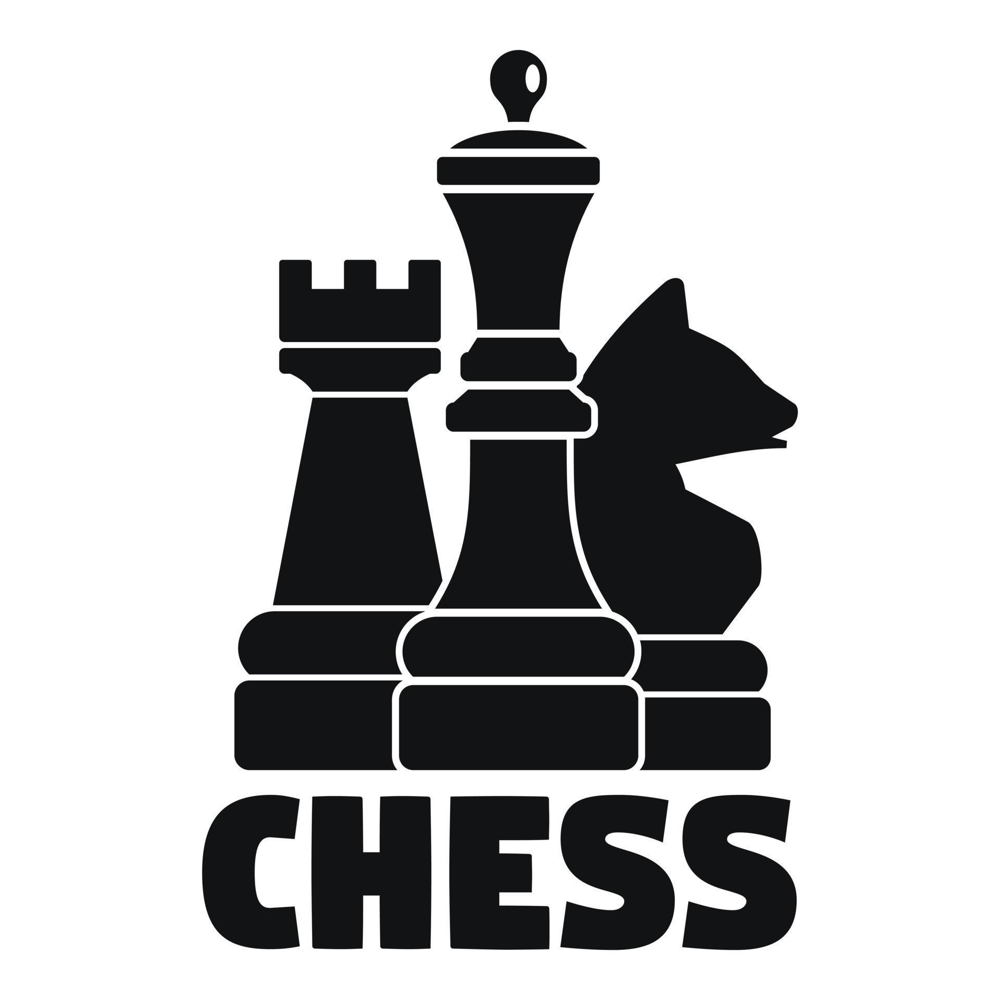
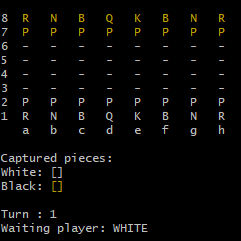

<div id="top">

<div align="center">



# <code>❯ Chess Game - Java</code>

<em>Implementação de um Jogo de Xadrez em Java</em>

[](https://github.com/pablorodriguesb/chess-system-java/blob/main/LICENSE)


</div>
<br>

---

## Conteúdo

- [❯ Chess Game - Java](#-chess-game---java)
	- [Conteúdo](#conteúdo)
	- [Visão Geral](#visão-geral)
	- [Funcionalidades](#funcionalidades)
	- [Estrutura do Projeto](#estrutura-do-projeto)
	- [Começando](#começando)
		- [Pré-requisitos](#pré-requisitos)
		- [Instalação](#instalação)
		- [Uso](#uso)
		- [Testes](#testes)
	- [Contribuição](#contribuição)
	- [Licença](#licença)
	- [Agradecimentos](#agradecimentos)

---

## Visão Geral

Este projeto consiste na implementação de um jogo de xadrez completo em Java. Ele oferece uma interface de linha de comando (CLI) para jogar xadrez, permitindo aos jogadores realizar movimentos, capturar peças e verificar o estado do jogo. O projeto segue os princípios da programação orientada a objetos para criar uma estrutura modular e extensível.



---

## Funcionalidades

- **Tabuleiro de Xadrez:** Representação completa do tabuleiro de xadrez.
- **Peças de Xadrez:** Implementação de todas as peças de xadrez (Rei, Rainha, Torre, Bispo, Cavalo e Peão) com seus movimentos específicos.
- **Movimentos Válidos:** Verificação de movimentos válidos para cada peça, seguindo as regras do xadrez.
- **Captura de Peças:** Mecanismo para capturar peças do oponente.
- **Interface de Linha de Comando (CLI):** Interface interativa para jogar o jogo no terminal.
- **Tratamento de Exceções:** Implementação de tratamento de exceções para lidar com movimentos inválidos e outras situações de erro.
- **Registro de Jogadas:** Armazenamento das jogadas realizadas durante a partida.
- **Lógica de Xeque e Xeque-Mate:** Implementação das regras para identificar xeque e xeque-mate.

---

## Estrutura do Projeto


```sh
└── /
    ├── pom.xml
    ├── src
    │   ├── main
    │   └── test
    └── target
        ├── chess-system-1.0-SNAPSHOT.jar
        ├── classes
        ├── generated-sources
        ├── generated-test-sources
        ├── maven-archiver
        ├── maven-status
```

<details open>
    <summary><b><code>/</code></b></summary>
    <details>
        <summary><b>__root__</b></summary>
        <blockquote>
            <div class='directory-path' style='padding: 8px 0; color: #666;'>
                <code><b>⦿ __root__</b></code>
            <table style='width: 100%; border-collapse: collapse;'>
            <thead>
                <tr style='background-color: #f8f9fa;'>
                    <th style='width: 30%; text-align: left; padding: 8px;'>Nome do Arquivo</th>
                    <th style='text-align: left; padding: 8px;'>Resumo</th>
                </tr>
            </thead>
                <tr style='border-bottom: 1px solid #eee;'>
                    <td style='padding: 8px;'><b><a href='pom.xml'>pom.xml</a></b></td>
                    <td style='padding: 8px;'>Arquivo de configuração do Maven para gerenciar dependências e construir o projeto.</td>
                </tr>
            </table>
        </blockquote>
    </details>
    <details>
        <summary><b>src</b></summary>
        <blockquote>
            <div class='directory-path' style='padding: 8px 0; color: #666;'>
                <code><b>⦿ src</b></code>
            <details>
                <summary><b>main</b></summary>
                <blockquote>
                    <div class='directory-path' style='padding: 8px 0; color: #666;'>
                        <code><b>⦿ src.main</b></code>
                    <details>
                        <summary><b>java</b></summary>
                        <blockquote>
                            <div class='directory-path' style='padding: 8px 0; color: #666;'>
                                <code><b>⦿ src.main.java</b></code>
                            <details>
                                <summary><b>com</b></summary>
                                <blockquote>
                                    <div class='directory-path' style='padding: 8px 0; color: #666;'>
                                        <code><b>⦿ src.main.java.com</b></code>
                                    <details>
                                        <summary><b>devpablo</b></summary>
                                        <blockquote>
                                            <div class='directory-path' style='padding: 8px 0; color: #666;'>
                                                <code><b>⦿ src.main.java.com.devpablo</b></code>
                                            <details>
                                                <summary><b>application</b></summary>
                                                <blockquote>
                                                    <div class='directory-path' style='padding: 8px 0; color: #666;'>
                                                        <code><b>⦿ src.main.java.com.devpablo.application</b></code>
                                                    <table style='width: 100%; border-collapse: collapse;'>
                                                    <thead>
                                                        <tr style='background-color: #f8f9fa;'>
                                                            <th style='width: 30%; text-align: left; padding: 8px;'>Nome do Arquivo</th>
                                                            <th style='text-align: left; padding: 8px;'>Resumo</th>
                                                        </tr>
                                                    </thead>
                                                        <tr style='border-bottom: 1px solid #eee;'>
                                                            <td style='padding: 8px;'><b><a href='src/main/java/com/devpablo/application/Program.java'>Program.java</a></b></td>
                                                            <td style='padding: 8px;'>Classe principal que inicia o jogo de xadrez.</td>
                                                        </tr>
                                                        <tr style='border-bottom: 1px solid #eee;'>
                                                            <td style='padding: 8px;'><b><a href='src/main/java/com/devpablo/application/UI.java'>UI.java</a></b></td>
                                                            <td style='padding: 8px;'>Classe responsável pela interface de usuário do jogo (CLI).</td>
                                                        </tr>
                                                    </table>
                                                </blockquote>
                                            </details>
                                            <details>
                                                <summary><b>boardgame</b></summary>
                                                <blockquote>
                                                    <div class='directory-path' style='padding: 8px 0; color: #666;'>
                                                        <code><b>⦿ src.main.java.com.devpablo.boardgame</b></code>
                                                    <table style='width: 100%; border-collapse: collapse;'>
                                                    <thead>
                                                        <tr style='background-color: #f8f9fa;'>
                                                            <th style='width: 30%; text-align: left; padding: 8px;'>Nome do Arquivo</th>
                                                            <th style='text-align: left; padding: 8px;'>Resumo</th>
                                                        </tr>
                                                    </thead>
                                                        <tr style='border-bottom: 1px solid #eee;'>
                                                            <td style='padding: 8px;'><b><a href='src/main/java/com/devpablo/boardgame/Board.java'>Board.java</a></b></td>
                                                            <td style='padding: 8px;'>Classe que representa o tabuleiro do jogo.</td>
                                                        </tr>
                                                        <tr style='border-bottom: 1px solid #eee;'>
                                                            <td style='padding: 8px;'><b><a href='src/main/java/com/devpablo/boardgame/BoardException.java'>BoardException.java</a></b></td>
                                                            <td style='padding: 8px;'>Classe que define exceções relacionadas ao tabuleiro.</td>
                                                        </tr>
                                                    </table>
                                                </blockquote>
                                            </details>
                                        </blockquote>
                                    </details>
                                </blockquote>
                            </details>
                        </blockquote>
                    </details>
                </blockquote>
            </details>
        </blockquote>
    </details>

---

## Começando

### Pré-requisitos

Este projeto requer as seguintes dependências:

- **Linguagem de Programação:** Java
- **Gerenciador de Pacotes:** Maven

### Instalação

Compile o código fonte e instale as dependências:

1. **Clone o repositório:**

    ```sh
    ❯ git clone ../
    ```

2. **Navegue até o diretório do projeto:**

    ```sh
    ❯ cd <nome-do-diretorio>
    ```

3. **Instale as dependências:**

    **Usando [Maven](https://maven.apache.org/):**

    ```sh
    ❯ mvn install
    ```

### Uso

Execute o projeto com:

**Usando [Maven](https://maven.apache.org/):**

```sh
mvn exec:java
```

### Testes

Este projeto utiliza o framework de testes JUnit. Execute o conjunto de testes com:

**Usando [Maven](https://maven.apache.org/):**

```sh
mvn test
```

---

## Contribuição

- ** [Junte-se às Discussões](https://github.com/pablorodriguesb/chess-system-java/discussions)**: Compartilhe suas ideias, forneça feedback ou faça perguntas.
<details closed>
<summary>Diretrizes de Contribuição</summary>

1. **Faça um Fork do Repositório**: Comece fazendo um fork do repositório do projeto para sua conta LOCAL.
2. **Clone Localmente**: Clone o repositório fork para sua máquina local usando um cliente git.
    ```sh
    git clone <url-do-seu-fork>
    ```
3. **Crie um Novo Branch**: Sempre trabalhe em um novo branch, dando-lhe um nome descritivo.
    ```sh
    git checkout -b nova-funcionalidade-x
    ```
4. **Faça Suas Alterações**: Desenvolva e teste suas alterações localmente.
5. **Commit Suas Alterações**: Faça commit com uma mensagem clara descrevendo suas atualizações.
    ```sh
    git commit -m 'Implementada nova funcionalidade x.'
    ```
6. **Push para o LOCAL**: Envie as alterações para seu repositório fork.
    ```sh
    git push origin nova-funcionalidade-x
    ```
7. **Envie um Pull Request**: Crie um PR contra o repositório do projeto original. Descreva claramente as alterações e suas motivações.
8. **Revisão**: Assim que seu PR for revisado e aprovado, ele será mesclado ao branch principal. Parabéns pela sua contribuição!
</details>

## Licença

Este projeto de jogo de xadrez é protegido pela Licença [LICENSE](https://choosealicense.com/licenses). Para mais detalhes, consulte o arquivo [LICENSE](https://choosealicense.com/licenses/).

---

## Agradecimentos

- Agradecimentos ao Nelio Alves, que me ajudou na criação deste jogo de xadrez em Java.

<div align="right">

[![Voltar ao Topo][back-to-top]](#top)

</div>

[back-to-top]: https://img.shields.io/badge/-VOLTAR_AO_TOPO-151515?style=flat-square

---